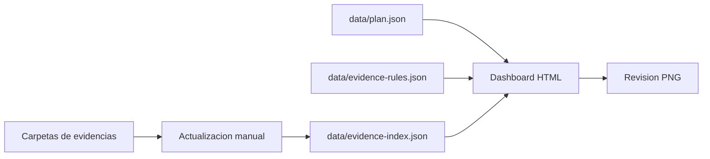

# Arquitectura del sistema

## Objetivo

Implementar un sistema liviano y manual para revisar el cumplimiento del Plan de Manejo Ambiental del Hostal Muyuyo mediante una estructura documental en GitHub y un dashboard HTML estatico.

## Principios

- El repositorio conserva la evidencia documental.
- El dashboard no reemplaza los verificadores oficiales.
- El estado de cumplimiento se calcula desde reglas del PMA y un indice manual de archivos cargados.
- Las actualizaciones quedan trazables mediante historial de GitHub.
- Las evidencias sensibles se manejan con control de acceso si el repositorio no es privado.
- No se utilizan API, tokens ni GitHub Actions.

## Componentes

| Componente | Tecnologia | Funcion |
| --- | --- | --- |
| Dashboard | HTML, CSS, JavaScript | Visualiza cumplimiento, verificadores, alertas y estados. |
| Matriz PMA | JSON | Define subplanes, medidas, frecuencia, responsables y verificadores. |
| Reglas de evidencia | JSON | Relaciona cada medida con carpetas y evidencias aceptadas. |
| Evidencias | Carpetas GitHub | Almacenan patente, bomberos, comprobantes, actas y certificaciones. |
| Indice manual | JSON | Lista las evidencias cargadas para que el dashboard pueda leerlas sin API. |
| Publicacion | GitHub Pages | Publica el dashboard como sitio estatico. |

## Flujo de datos

## Deteccion de cumplimiento

El dashboard cruza tres fuentes:

1. `data/plan.json`: contiene subplanes, medidas, responsables, frecuencia y verificadores.
2. `data/evidence-rules.json`: indica que carpeta o patron documental prueba cada medida.
3. `data/evidence-index.json`: lista manualmente los archivos cargados en `evidencias/`.

Cada medida recibe un estado:

- `cumple`: existe evidencia valida para la frecuencia y periodo.
- `pendiente`: aplica la medida, pero no existe evidencia cargada.
- `no_aplica`: la medida no corresponde al periodo revisado.
- `en_correccion`: existe novedad o accion correctiva abierta.

## Operacion sin API

El dashboard opera en modo lectura. No crea archivos, no modifica GitHub y no requiere usuario o contrasena.

La actualizacion se hace en tres pasos:

1. Subir la evidencia a la carpeta correspondiente.
2. Agregar la ruta del archivo en `data/evidence-index.json`.
3. Publicar los cambios en GitHub.
